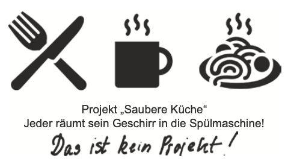

class: center, middle

## [Software Projektmanagement](index.html)

#### Kapitel 02

# Projektmanagement - Was versteht man darunter?

Oliver Elias Adler

---

 Projektmanagement - Was versteht man darunter?

----

### Vorab: Was ist ein Projekt?

  

---

 Projektmanagement - Was versteht man darunter?

----

### Kein Projekt, sondern ein Prozess!

* **Vorhaben**, welchses..

    * ..zeitlich begrenzt

    * ..einmalig        ..ist!

---

 Projektmanagement - Was versteht man darunter?

----

### Definition:

* nach DIN 69901
    * Gesamtheit von Führungsaufgaben, -organisation, -techniken und -mittel für die Abwicklung eines Projekts“

---

Die Rolle des Projektleiters?

----

### Projektleiter vs. Dirigient

   * **Aufgaben:**

    * Zusammenarbeit im Team steuern.

    * Verantwortlich für das erfolgreiche Projekt

    * Erreichen der definierten Ziele

---
Themengruppen des Projektmanagements

----
**Im Projektmanagement gibt es spezielle Themen, für die man bestimmte Schritte, Werkzeuge und Ergebnisse kennt und nutzt.** 

* Scope
* Stakeholder
* Resource
* Time
* Cost
* Quality

    und weitere...

## [&#10154;](?url=03.kapitel.md)

