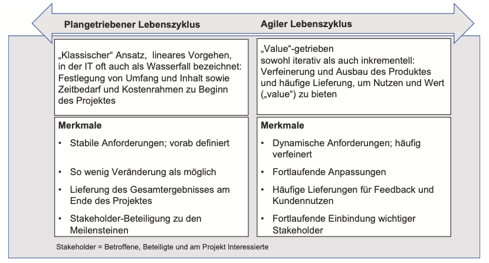
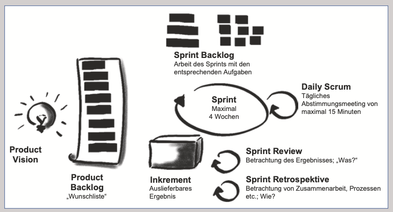
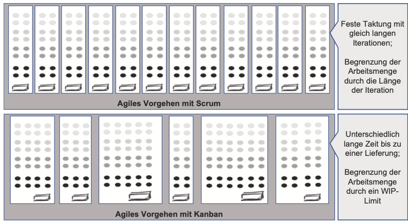

class: center, middle

## [Software Projektmanagement](index.html)

#### Kapitel 03

# Welche Ansätze gibt es?
Oliver Elias Adler

---
Verschiedene Ansätze des Projektmanagements

----

### 1. Ansatz 
* Klassisches
    * eignet sich für bereits bekanntes Terrain
    * plangetrieben
    * Für Bewertung eines Projektes:
    
        --> Magische Dreieck 
    * Iterativ angepasst!

---
Verschiedene Ansätze des Projektmanagements

----
    
  

---
Verschiedene Ansätze des Projektmanagements

----
   
### Klassisches (Plangetrieben)
* Definiert: Inhalt, Umfang, Zeit und Kosten zu Beginn

Geeignet, wenn:
* Ergebnis genau spezifiziert

* Ähnliche vorherige Projekte

* Wenige Änderungen erwartet

* Einfache Sachverhalte...

---
Verschiedene Ansätze des Projektmanagements

**Klassisches Projektmanagement**

----

### Ablauf

* Projektleiter verantwortlich, aber Team-Planung bevorzugt

* Themengruppen definieren und/oder abschätzen...

    Beispiele:

    * Scope: Inhalt und Umfang des Projekts definieren

    * Ressourcen schätzen und Projektorganisation festlegen

* "Scope Creep"

---
Verschiedene Ansätze des Projektmanagements

**Agiles Projektmanagement**

----

### 2. Ansatz 
* Agiles

    * Maximierung des Wertes innerhalb des geg. Rahmens (kann sich Ändern!)

    * agile Methode

        * Scrum und Kanban (später mehr dazu)

---
Agiles Projektmanagement

----

### Agiles (Flexibilität und Anpassungsfähigkeit)
Unklare oder sich ändernde Anforderungen
Geeignet, wenn:

* Unklare Ergebnisse und Anforderungen

* Betritt Neuland (inhaltlich/technisch)

* Komplexe Sachverhalte

* Zentrales Feedback und Lernen

* Änderungen basierend auf Feedback

---
Agiles Projektmanagement

----

### „Never compromise quality“

* kontinuierliche Erweiterung und Verbesserung.

* Fokus auf das zu lieferende Werk 

* bei reine Arbeitsergebnisse gilt „just enough“

* Keine Kompromisse beim Produkt o. Endergebnis

---
Verschiedene Ansätze des Projektmanagements

----

*    

---
Verschiedene Ansätze des Projektmanagements

**Projektlebenszyklus**

----
* **Bildlich: Klare Wege und Ziele vs. Bildlich: Unklare Wege, möglicher "Nebel"**

  

---
Agiles Projektmanagement 

**Themengruppen und ihre Anwendung**

----

| Themengruppe | Anwendung im klassischen Projekt | Anwendung im agilen Projekt |
|--------------|---------------------------------|----------------------------|
| Integration  | Alle Überlegungen werden im Projektmanagementplan dokumentiert | Verantwortung verlagert sich auf Team; kollaborativer Ansatz; Projektleiter sorgt für passendes Umfeld |
| Stakeholder  | Stakeholder als Betroffene und Interessierte | Aktive Beteiligung; direkte Interaktion; Zusammenarbeit mit Kunden und Anwendern |
| Scope        | Was ist zu tun? Organisation der Arbeit | Fortlaufende Definition und Anpassung; Nutzung des Product Backlogs |
| Resource     | Teammitglieder, Know-how, Ressourcen | Funktionsübergreifende, selbstorganisierte Teams; Wissen teilen; Reflexion der Arbeitsweise |
| Time         | Wie lange dauert es, den Scope abzudecken? | Schnelles Feedback, grobe Planung für ferne Zukunft |

---
Agiles Projektmanagement - Themengruppen und ihre Anwendung

----

| Themengruppe | Anwendung im klassischen Projekt | Anwendung im agilen Projekt |
|--------------|---------------------------------|----------------------------|
| Cost         | Was wird es kosten, den Scope abzudecken? | Einfache Schätzmethoden, festes Budget und Zeitrahmen |
| Risk         | Risikomaßnahmen und -management | Vielfältige Risikoadressierung; funktionsübergreifendes Team; tägliche Zusammenarbeit |
| Quality      | Qualitätsicherung und -prüfung | Definition-of-Done; Retrospektiven; schnelle Feedbackschleifen |
| Procurement  | Regelungen und Verträge | Anbieter-Käufer-Zusammenarbeit; agile Scope-Anpassung; Risikoteilung |
| Communication| Dokumentation und Kommunikation | Zeitnahe, komprimierte Darstellung; Verschiebung von Dokumentation zu Diskussion |

---
Agiles Projektmanagement 

**Scrum**

----
### Scrum
* empirische Vorgehensweise

* „Inspect and Adapt“ (Überprüfen und Anpassen)

* "Scrum" => Analogie aus dem Rugby

* für kleinere Teams geeignet

 
[2] 

---
Agiles Projektmanagement 

**Scrum**

----

---
Agiles Projektmanagement 

**Scrum**

----

### Scrum-Rollen

* Product Owner 
    * Quälitätsicherung
    * Führt Product Backlog
    * Aufgabe verteilen
    * Fortschritt überwachen
* Scrum Master: 
    * Scrummethode einhalten
    * Führung
    * Zielsetzung und Organisation
* Developer 
    * für die einzelnen Sprint, 
    * Führen Sprint Backlog 

Alle sind gleichberechtigt!

---
Agiles Projektmanagement 

**Scrum**

----

### Scrum Artefakte

* Product Backlog:
    - Things to be done

* Sprint Backlogs:
    - Fortschritt und Plan der Schritte

* Increment:
    - Meilensteine

---
Agiles Projektmanagement 

**Scrum**

----

### Sprint

- Miniprojekt (max. 4 Wochen):   
Stück für Stück Entwicklung
    * Tranparente Arbeit -> Inspektion -> Adption

[1]  

---
Agiles Projektmanagement 

**Scrum**

----

### Sprint-Planung:

* Wie, Was, Warum Fragen beantworten vor jedem Sprint

* Daily Scrum (15 min)
* Sprint Review - Resume des Sprints 
* Sprint Retrospective - Struktur des Sprints

 

  

---
Agiles Projektmanagement 

**Kanban**

----

* Macht Arbeit sichtbar.
* Limitiere den Work in Progress, also die Menge an begonnener Arbeit.
* Implementiere (häufige) Feedbackmechanismen
* **„Stop starting, start finishing“**

  

---
Agiles Projektmanagement 

**Scrum vs Kanban**

----

 * Iterationen fest geplant
 * Arbeit herunterbrechen vs Arbeitshappen
 * Rollen vs keine Rollen
 
---
Agiles Projektmanagement 

**Scrum vs Kanban**

----
Scrum, für..
*   feste Taktung - siehe Sprints

Kanban, für..
* Flexibilität in Bezug auf Arbeitsvolumen
* mehrere Themen
* Verschwendungen reduzieren duch Doppelarbeit, Meetings,etc

**Hybrides Projektmanagement**

* gemischt aus beiden
    Klassisches, plangetriebenes Vorgehen, aber mit Standup Meeting 

---
## Zusätzliche Quellen

----

[1] https://www.etventure.de/blog/digitallearning-2-agiles-arbeiten-mit-scrum/

[2] https://www.google.com/search?sca_esv=574510585&sxsrf=AM9HkKlCnV1in
    56P452cosePYkmByRY2wA:1697654113066&q=scrum+rugby&tbm=isch&source=ln
    ms&sa=X&sqi=2&ved=2ahUKEwi6i_GynoCCAxXUtqQKHd4xAAUQ0pQJegQIEBAB&biw=
    1440&bih=722&dpr=2#imgrc=GmLGsiyKWwSqXM

https://www.youtube.com/watch?v=Rk-r3AHgpkk&ab_channel=shribe%21-masteryourstudies

https://de.smartsheet.com/triple-constraint-triangle-theory

## [&#10154;](?url=04.kapitel.md)

