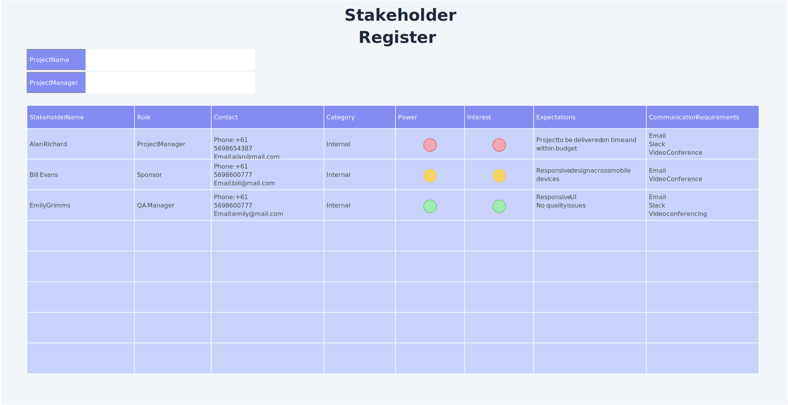

class: center, middle

## [Software Projektmanagement](index.html)

#### Kapitel 08

# Stakeholder

Philip Kiesler

---
 Stakeholder - Wer ist das?

----

Grobe Übersetzung: Akteur, Interessenvertreter, Anspruchsberechtigter

- Personen
- Gruppen
- Organisationen

---
 Stakeholder - Beispiel

----

---

Stakeholder - Analyse

----

### Ziele

- Identifikation
- Bewertung
- Einflusses
- Auswirkung

---

Stakeholder - Analyse

----

### Schritte der Analyse

- Identifikation der Stakeholder
- Analyse der Interessen und Bedürfnisse
- Bewertung des Einflusses
- Priorisierung
- Entwickeln von Strategien
- Umsetzung und Überwachung
- Stakeholder-Analyse Workshop
- Stakeholder-Register

---

Stakeholder - Register Beispiel

----

### Das Stakeholder-Register

---
Stakeholder - verschiedene Strategien

----

- Partizipative Strategie – Stakeholder als Partner
- Diskursive Strategie – Stakeholder im Gespräch
- Repressive oder restriktive Strategie – informierte Stakeholder

---
Stakeholder - Personas

----

- Hypothetische Nutzer
- Kunden besser verstehen
- priorisieren 

---

Stakeholder - Personas Beispiel

----

### Personas

## [&#10154;](?url=09.kapitel.md)
