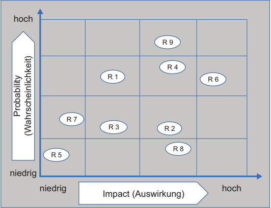

class: center, middle

# Risiken

---

Was sind Risiken?

* Unwägbarkeiten, die im Falle des Eintretens den Projektverlauf oder das
Ergebnis positiv oder negativ beeinfussen können.
   

# Planungsschritte im Risikomanagement

* Wie wird vorgegangen (Standarts festlegen)
* Welche Risiken gibt es
* Bedeutung der Risiken für das Projekt (Priorisierung)
* Wie lassen sich Risiken beeinflussen (Eintrittswahscheinlichkeit und/oder Schwere beeinflussen)

---

# Risiken bestimmen

* Segelschiffworkshop (Risiken und Chancen entwickeln)
* Tabelle mit Ursache und Risiko
* Wähernd des Projekts können neue Risiken entstehen

---
# Bedeutung der Risiken
* Eintrittswahrscheinlichkeit bestimmen
* Auswirkung bestimmen

-> Probability-Impact-Matrix erstellen

---
# Bewertung der Risiken in Euro
* Risiken wird ein Geldbetrag zugeordnet

-> Eintrittswahrscheinlichkeit (in %) multipliziert mit dem Impact bei Eintreten des Risikos
(in Euro).

* Wie groß müsse finanzielle Reserven sein
---
# Wie lassen sich Risiken beeinflussen 

#### Strategien bei Risk Response

* **Eskalieren:** 
Wenn Bedrohung oder Chance und/oder die möglichen Maßnahmen außerhalb der Einfussmöglichkeit des Projekts liegen.
* **Vermeiden von Bedrohungen, Nutzen von Chancen:**  Gefährdetes Ziel anpassen oder Ursache ausräumen.  
Für Chancen die Eitrittswahscheinlichkeit erhöhen, z.B. über bessere Technologien oder Änderung der Reihenfolge der geplanten To-dos
* **Übertragen von Bedrohungen, Teilen von Chancen:**
Verantwortung für Risiko an dritte übertragen, z.B. Kauf von Versicherungen oder Outsourcing.
Chancen können durch Bildung von Partnerschaften geteilt werden
* **Mindern von Bedrohungen, Verbessern von Chancen:**
Maßnahmen finden um Eintrittswahrscheinlichkeit oder Auswirkung zu beeinflussen.
* **Akzeptieren:**
Wenn das Risiko nur eine geringe Bedeutung hat oder man die Eintrittswahrscheinlichkeit schwer oder garnicht beeinflussen kann