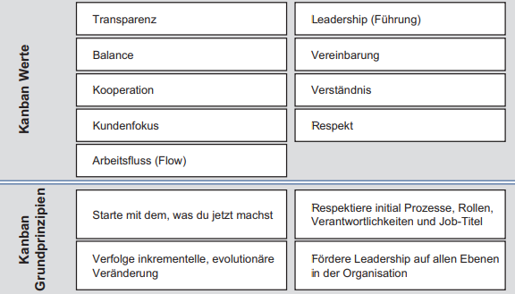

class: center, middle

## [Software Projektmanagement](index.html)

#### Kapitel 18

# Einführung in Kanban
Simon Gartzke

---

Was ist Kanban

----

- Agile Methode für Projektmanagament 
- strebt kontinuierliche Verbesserungen an 
- erhöhte Transparenz 
---

Die Werte und Grundprinzipien von Kanban

----

## [&#10154;](?url=19.kapitel.md)
