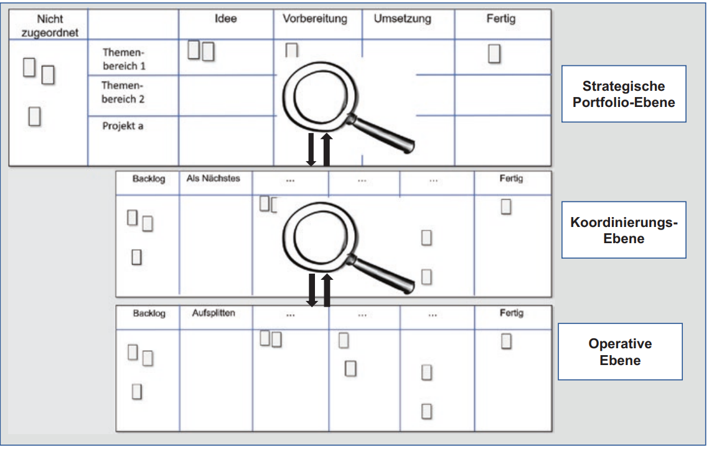

class: center, middle

## [Software Projektmanagement](index.html)

#### Kapitel 20

# Die Kanban Flight Level

Pascal René Daniel

---
 Die Kanban Flight Level

----
**Begriff Flight Level im Allgemeinen**

 

- In der Luftfahrt gibt das Flight Level eine Flughöhe in Fuß an

- Höhenangabe bezieht sich auf einen standardtisierten Luftdruck

- Alle Flugzeuge richten sich auf diesen Standard aus

 

> Somit wird der Luftraum für die navigation der Flugzeuge sicher vertikal aufgeteilt

---
Die Kanban Flight Level

----

**Flight Level in Kanban**

 

- Je höher man fiegt, desto weniger Details sieht man, aber dafür ist der Überblick besser

- Je niedriger man fliegt, umso mehr Details sieht man, aber dafür ist der Überblick schlechter
  

> ***"Flight Level"*** beschreibt somit das Anwenden von Kanban-Systemen auf Teamebene bis zur Steuerung der gesamten Organisation.

 

***"Wertstrom (,,value stream'')"***

umfasst alle Schritte, die erforderlich sind, um ein Produkt oder eine Dienstleistung vom Auftragseingang bis zur Auslieferung zu erstellen, darunter Analyse, Design, Umsetzung und Auslieferung.

---
Die Kanban Flight Level

----

### Flight Level Ebenen

---
Die Kanban Flight Level

**Flight Level Ebenen**

----

**Flight Level 1 Operative Ebene**

 

- ist auf die lokale Arbeitsoptimierung fokussiert.
  
- Ein einzelnes Team verwendet Kanban-Praktiken, um die Visualisierung seiner Arbeit zu verbessern.
  
- Geeignet für Projekte, bei denen ein Team Kundenwünsche umsetzt.

 

Bei komplexeren Projekten oder mehreren beteiligten Teams stößt es an Grenzen.

Hier kommt ***"Flight Level 2"*** ins Spiel.

---
Die Kanban Flight Level

**Flight Level Ebenen**

----

**Flight Level 2 Koordination mehrerer Teams**

 

- teamübergreifende Koordination & die Optimierung des gesamten Wertstroms

- alle Teams einbezogen, die an der Umsetzung von Kundenwünschen & der Bereitstellung von Leistungen im Wertstrom beteiligt sind

- steht die Optimierung der Zusammenarbeit und die Begrenzung der Arbeitslast im Fokus

- einzelnen Teams unter diesem Koordinierungsboard ihre eigenen Teamboards verwenden können
  -  -> Kanban ist dabei keine Pflicht

---
Die Kanban Flight Level

**Flight Level Ebenen**

----

**Flight Level 3 Strategische Portfolioebene**

 

- geht es darum, wie ein Unternehmen seine verschiedenen Projekte, Programme und strategischen Initiativen koordiniert

- Ziel ist, sicherzustellen, dass diese Initiativen gut zusammenarbeiten und die Ressourcen sinnvoll genutzt werden

- Auf dieser Ebene geht es darum, klug zu entscheiden, welche Projekte Vorrang haben und wie Ressourcen am besten genutzt werden können.
  -  Strategieboard hilft dabei, den Überblick über all diese Entscheidungen zu behalten

---
Die Kanban Flight Level

----

**Das Strategieboard**

*Zusammenspiel der Flight Level*

- Board bildet auf der oberstenen Ebene die Arbeiten ab
   - -> es lässt sich der Stand von Projekten mitverfolgen

  
---
Die Kanban Flight Level

----

**Nutzen der Flight Level**

- je höher die Ebene um so größer der Hebel für Veränderungen

- Kanban auf Level 1 kann dazu führen, dass durch positive Erfahrungen, das Kanban verfahren auf höhreren Ebenen angewandt wird

- Kanban auf Level 3 einzusetzen, kann auch dazu führen das die darunterliegenden Level sich dem System anschließen

- sollte ein Unternehmen ein Strategieboard verwenden, würde das bedeuten das alle Ebenen die Möglichkeit haben mit Kanban zu arbeiten

Flight Level sind ein Kommunikationsinstrument und helfen bei der Entscheidungsfindung. Mit den Flight Levels kann die zu erwartende Wirkung des Einsatzes von Kanban auf den drei Ebenen dargestellt werden.