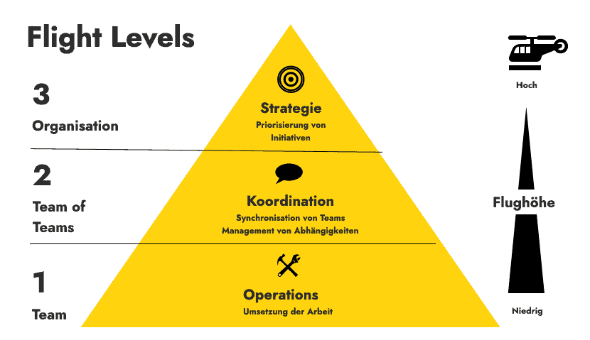

class: center, middle

## [Software Projektmanagement](index.html)

#### Kapitel 20

## Kanban auf verschiedenen Ebenen einsetzen 

## Die Kanban Flight Level

Pascal Daniel

---
Die Kanban Flight Level

----

**Flight Level in Kanban Systemen**

[1] [2]

---
Die Kanban Flight Level

**Flight Level Ebenen**

----

**Flight Level 1 Operative Ebene**

 

- ist auf die lokale Arbeitsoptimierung fokussiert.
  
- Ein einzelnes Team verwendet Kanban-Praktiken, um die Visualisierung seiner Arbeit zu verbessern.
  
- Geeignet für Projekte, bei denen ein Team Kundenwünsche umsetzt.

---
Die Kanban Flight Level

**Flight Level Ebenen**

----

**Flight Level 2 Koordination**

 

- teamübergreifende Koordination & die Optimierung des gesamten Wertstroms

- alle Teams einbezogen, die an der Umsetzung von Kundenwünschen beteiligt sind

- steht die Optimierung der Zusammenarbeit und die Begrenzung der Arbeitslast im Fokus

---
Die Kanban Flight Level

**Flight Level Ebenen**

----

**Flight Level 3 Strategische Portfolioebene**

 

- verschiedenen Initiativen koordiniert werden im Unternehmen

- Ziel = dass die Initiativen gut zusammenarbeiten

- klug zu entscheiden, welche Projekte Vorrang haben und wie Ressourcen am besten genutzt werden können
  
  &rdca;  Strategieboard hilft dabei, den Überblick über all diese Entscheidungen zu behalten

---
Die Kanban Flight Level

----

**Das Strategieboard**

*Zusammenspiel der Flight Level*

- Board bildet auf der oberstenen Ebene die Arbeiten ab
  
   &rdca; es lässt sich der Stand von Projekten mitverfolgen

  
---
Die Kanban Flight Level

----

**Nutzen der Flight Level**

- je höher die Ebene um so größer der Hebel für Veränderungen

- Kanban auf Level 3 einzusetzen, kann dazu führen das die darunterliegenden Level sich dem System anschließen
  
**Zusammenfassend**

- Flight Level sind ein Kommunikationsinstrument
  
- helfen bei der Entscheidungsfindung. 
  
- mit den Flight Levels kann die zu erwartende Wirkung des Einsatzes von Kanban auf den drei Ebenen dargestellt werden.

## [&#10154;](?url=21.kapitel.md)

---

# Zusätzliche Quellen

----

[1] https://www.it-agile.de/agiles-wissen/agile-arbeit/was-sind-flight-levels/

[2] https://digitaleneuordnung.de/blog/flight-levels/