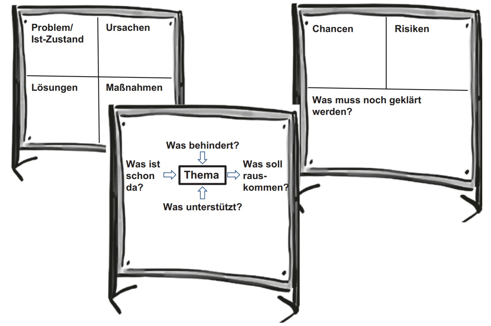

class: center, middle

## [Software Projektmanagement](index.html)

#### Kapitel 21

# Die Gestaltung von Meetings und Workshops

Pascal Daniel

---
Die Gestaltung von Meetings und Workshops

----

### Die Rollen(Rollenverteilung)

 

In jedem **Workshop** oder moderierten **Meeting** gibt es klare Rollen und damit auch Verantwortlichkeiten.

|Rolle|Verantwortung|
|-|-|
|||
|**Auftraggeber**|für die Vorgabe des Ziels verantwortlich|
|**Moderator** |Plant & steuert den Workshop|
||Verantwortlich für den Ablauf der Veranstaltung|
||Unterstützt bei Bedarf und fördert das selbstständige Arbeiten jedes einzelnen aus der Gruppe|
|**Teilnehmer**|sind für die Qualität des Ergebnisses verantwortlich|

---

Die Gestaltung von Meetings und Workshops

----

### Das Handwerkszeug des Moderators

Je umfassender der Wissensstand und die Handswerkzeuge des Moderators sind, umso gezielter und flexibler kann er in seiner Rolle arbeiten.

 

- **Fragetechnik PAKKO Modell**

- **Visualisieren**

- **Paraphrasieren**

- **Zusammenfassen**

---

Die Gestaltung von Meetings und Workshops

**Das Handwerkszeug des Moderators**

----

### PAKKO Modell

 

||| |
|-------------|---------------------------------------------|--------|
| **P**  | Persönlich                | Du, Sie, Ihr…  |
| **A** | Aktivierend                      | Nach persönlichen Erlebnissen fragen  |
| **K**  | Kurz und Knackig                                            | Einfache Sätze, keine Bandwurmkonstrukte, keine Verschachtelungen  |
| **K**  | Konkret                                            | Nach einem konkreten Aspekt des Themas fragen  |
| **O**  | Offen                                           | Offene W-Fragen stellen: wer, wann, was, warum, wie?

---
Die Gestaltung von Meetings und Workshops

**Das Handwerkszeug des Moderators**

----

### Visualisieren

>**Aufgaben des Moderators**

> - Richtige Raumwahl und Arbeitsmaterial bereit stellen(Flipchart)

> - Visualisierungsmöglichkeiten bereitstellen

- Unterstützt gemeinsames Arbeiten
  
- Probleme werden konkreter diskutiert

### Paraphrasieren

- Man wiederholt das Empfangene mit seinen eigenen Worten
  
- Sachlichen Inhalt wiedergeben

---
Die Gestaltung von Meetings und Workshops

**Das Handwerkszeug des Moderators**

----

### Zusammenfassen

- kurze Zusammenfassung nach Diskussion

- gemeinsames Verständis abgleichen

---
Die Gestaltung von Meetings und Workshops

----

## Phasen der Moderation und ausgewählten Techniken

---

Die Gestaltung von Meetings und Workshops

**Phasen der Moderation und ausgewählten Techniken**

----

**Einstiegsphase**

- Jeder Teilnehmer erzählt kurz sein bisher schönstes Erlebnis am heutigen Tag
   
- Flipchart vorbereiten mit Bewertungsschema

 

**Themen sammeln und clustern**

- Teilnehmer Ideen aufschreiben und aufhängen
  
- Zusammenfassen der Ideen bzw. Clustern
  

---

Die Gestaltung von Meetings und Workshops

**Phasen der Moderation und ausgewählten Techniken**

----

**Thema auswählen**

- Themenliste erstellen und gewichten
  
  -> Chronologisch auswählen oder das höher gewichtete wählen

 

**Thema bearbeiten**

- Thema ins Ishikawa-Diagramm übertragen

- Mind-Map 

- Bearbeitung in Kleingruppen

---
Die Gestaltung von Meetings und Workshops

**Phasen der Moderation und ausgewählten Techniken**

----

**Maßnahmen planen**

 - Tabelle mit den geplanten Maßnahmen
    - Thema
  
    - Wer?

    - Bis wann?
  
    - Mit wem? 

**Abschluss**

- Feedback einzuholen
  
  - Was war im Workshop hilfreich?
  
  - Was war hinderlich? 
  

---
Die Gestaltung von Meetings und Workshops

**Vorbereitung eines Meetings oder Workshops**

----

**Wichtige Fragestellungen - Moderator**

 

- Ziel und Nutzen des Meeting/Workshops?

- Welche Risiken könnten bestehen?
 -> Wie geht man damit um?

- Was ist das angestrebte Ziel?
  
- Wer und welche Rollen?

---
Die Gestaltung von Meetings und Workshops

**Vorbereitung eines Meetings oder Workshops**

----

**Einladung**

- Uhrzeit richtig wählen für das Meeting
  
- Ziel der Veranstaltung angeben

**Material**

- Haftnotizen und Stifte bereitstellen
  - Geeignete Farben und Größen der Stifte verwenden

- Pinnwand und ähnliches

- Kreppband, Klebepunkte, weiteres
  - um Sachen zu befestigen oder für Abstimmungen

---
Die Gestaltung von Meetings und Workshops

**Durchführung des Meetings oder Workshops**

----

### Praktische Hinweise

**Timeboxen**

- Zeitspanne vorher festlegen
- Sichtbare Uhr bereitstellen 
- Bei Ablaufen der Zeit, kurz vor ende Bescheid geben

**Hinweise zum Beschriften von Karten/Haftnotizen**

- Karteikarten nur mit gut lesbaren Filzstift beschriften
- Ein Punkt auf eine Karteikarte und kurz fassen
- Nur Druckschrift und Groß
  
**Weitere Hinweise**

- Offene Fragen für alle Teilnehmer sichtbar darstellen -> Flipchart
  
- Flipchart in kombination mit Pinnwand für jegliche Notizen
  
---
Die Gestaltung von Meetings und Workshops

**Durchführung des Meetings oder Workshops**

----

### Erste Kennenlernen

 

**Alternative Reihenfolgen**

-  nach Geburtstagen

**Ball als Redezeichen** 

- Ball irgendeinem zu werfen

**Partnerinterview**

- zwei Teilnehmer die sich nicht kennen

**Steckbrief**

- wird vorher verfasst und für alle sichtbar aufgehängt/angepinnt

---
Die Gestaltung von Meetings und Workshops

**Durchführung des Meetings oder Workshops**

----

### Ideen für Gruppenbildung
  
- Spielkarten ziehen
  
- Gruppenbildung über Motive
  
- Paarbildung durch Ketten/Seile

 

**Sinn von Kleingruppen?**

- mehr Ideen
  
- intensiver Austausch
  

---
Die Gestaltung von Meetings und Workshops

**Durchführung des Meetings oder Workshops**

----

  **Genaue Punkte vorab bestimmen:**

  - Ziel der Gruppenarbeit
  
  - Aufgabenstellung für die Gruppenarbeit
  
  - Rollenklärung -> wer macht was

 

**Austausch der Gruppenergebnisse im Plenum**

  - Ergebnis präsentieren
  
    - mit der ganzen Gruppe 
  
    - Ergebnisse nochmal kürzer fassen bzw. Clustern

---
Die Gestaltung von Meetings und Workshops

**Durchführung des Meetings oder Workshops**

----

### Meinungsbilder und Abstimmungen

- **Punkte kleben**
  
  - Einpunktfrage -> eine Stimme abgeben bzw. ein Klebepunkt
  
  - Mehrpunktfrage -> mehrere Stimmen abgeben
  
 
  
- **Räumlich abstimmen**
  
  - jede Ecke hat eine andere Auswahlmöglichkeiten
  
  - Stellen im Raum bestimmen die Auswahlmöglichkeiten
  
 

- **Daumen hoch, runter oder waagerecht**
  

---
Die Gestaltung von Meetings und Workshops

**Abschluss der Moderation und Nachbereitung**

----

 
**Ausblick**

- nächstes Treffen vereinbaren
  
- Themenwünsche für den nächsten Workshop schonmal besprechen

 

**Protokoll**

- Von den Ergebnissen Fotos machen und als PDF zusammenfassen
  
- fertiges Protokoll zeitnah an alle Teilnehmer versenden

---
Die Gestaltung von Meetings und Workshops

**Spielregeln für Meetings**

----

### Verhaltensregeln

---

class: center, middle

# Fragen?

## [&#10154;](?url=22.kapitel.md)
