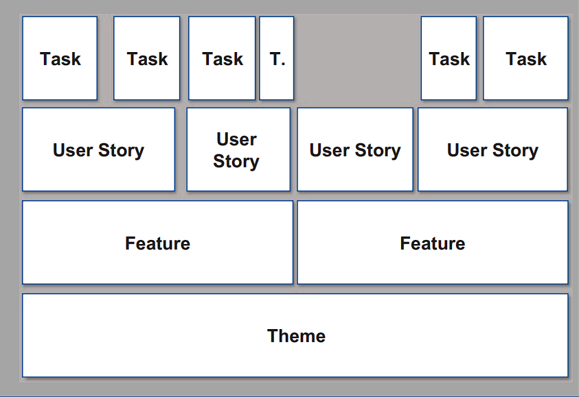

class: center, middle

## [Software Projektmanagement](index.html)

#### Kapitel 11

# Themes, Epics, Features, User Stories, Tasks To-dos in unterschiedlicher Granularität

Jan Schröder

---
Themes, Epics, Features, User Stories, Tasks To-dos in unterschiedlicher Granularität

---

---
Themes, Epics, Features, User Stories, Tasks To-dos in unterschiedlicher Granularität

---
# Warum?

Das Akronym **Deep**

- **D =** Das Produkt Backlog ist ""detailed apprpriately""
- **E =** Das Prdukt backlog ist emergent
- **P =** das Produkt Backlog ist priorisiert

---
Themes, Epics, Features, User Stories, Tasks To-dos in unterschiedlicher Granularität

---
**User Stories als Format**

- Auch für Feature
---
Themes, Epics, Features, User Stories, Tasks To-dos in unterschiedlicher Granularität

---
Zusätzlich gibt es die **3C**

| 3C | Bedeutung |
|:------:|:----------:|
| **Card** | Karte auf die User Story geschrieben wird |
| **Conversation** | Unterhaltung und Erklärung zu User Story|
| **Confirmation** | Bestätigung - Akzeptanzkriterien |

---
Themes, Epics, Features, User Stories, Tasks To-dos in unterschiedlicher Granularität

---

**User Stories**

Erfüllen das Arkronym **Invest**
- **I**ndependent = Die Storys sollen voneinander unabhängig sein
- **N**egotiable = Nicht alles ist niedergeschrieben es gibt verhandlungsraum
- **V**aluable = User Stories sollen etwas zu dem Produkt beitragen
- **E**stimatable = Der Aufwand für die Umsetzung muss einschätzbar sein
- **S**mall = Fortschritt von Abreitschritt zu Arbeitsschritt ist Überschaubar
- **T**estable = Es muss die Möglichkeit geben eine User Story zu testen

---
Themes, Epics, Features, User Stories, Tasks To-dos in unterschiedlicher Granularität

---

**Verfahren zum Schneiden**
- Splitten nach Workflow 
- - Gefahr besteht darin das Abhängigkeit zwischen den User Stories entsteht
- Splitten nach Geschäftsregeln
- Splitten nach Aufwand
- Variationen in den Daten
- - Verschiedene Sprachen
- Nach Operationen wie Lesen, Neuerfassen, Ändern, Löschen
---

class: center, middle

# Fragen?