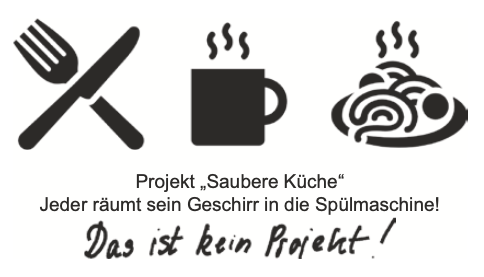
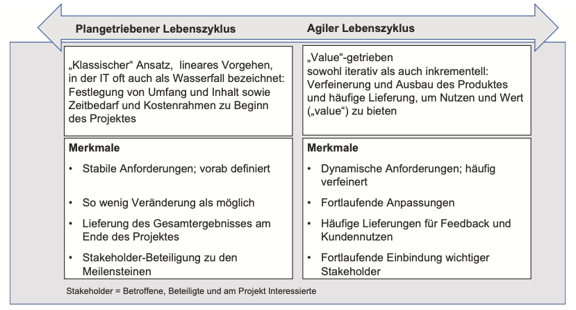
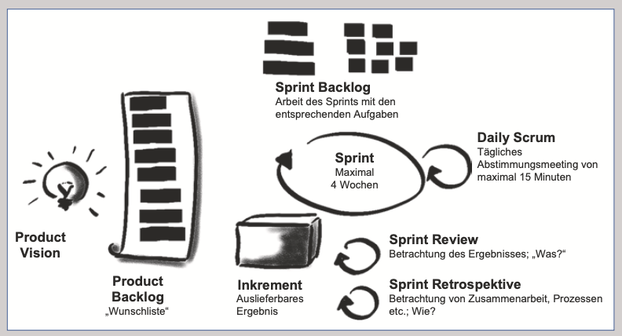

# Projektmanagement

---

 ## Was ist Projektmanagement?

----

## Vorab

    Was ist ein Projekt?

---

Was ist Projekt?

----
  Bild!

Quelle: Buch!

---

Was ist Projekt?

    Kein Projekt, sondern ein Prozess!

----

* Vorhaben, welchses..

    * ..zeitlich begrenzt
    * ..einmalig

        ist!

---

Was ist Projektmanagement?

----

## Definition:

* nach DIN 69901
    * Gesamtheit von Führungsaufgaben, -organisation, -techniken und -mittel für die Abwicklung eines Projekts“

---

Die Rolle des Projektleiters?

----

        Projektleiter vs. Dirigient

   * **Aufgaben:**

        * Zusammenarbeit im Team steuern.
        * Verantwortlich für das erfolgreiche Projekt
        * Erreichen der definierten Ziele

---
Themengruppen des Projektmanagements

----

**Im Projektmanagement gibt es spezielle Themen, für die man bestimmte Schritte, Werkzeuge und Ergebnisse kennt und nutzt.**

* Scope
* Stakeholder
* Resource
* Time
* Cost
* Quality

    und weitere...

---
Themengruppen des Projektmanagements

----

### Beispiel

Inhalt und Umfang des Projektes (der Scope) sind nun klar, aber pas- sen die dafür geschätzte Zeit und die geschätzten Kosten in einen eventuell vorgegebe- nen Rahmen oder müssen Inhalte angepasst werden, um den Rahmen nicht zu sprengen?

---
Verschiedene Ansätze des Projektmanagements

----

## 1. Ansatz 
* Klassisches
    * eignet sich für bereits bekanntes Terrain
    * plangetrieben; alles wird schriftlich festgehalten
    * Für Bewertung eines Projektes:
    
        --> Magische Dreieck 
    
      Bild!

    Quelle: https://de.smartsheet.com/triple-constraint-triangle-theory

    * Iterativ angepasst!

---
Verschiedene Ansätze des Projektmanagements

----

## 2. Ansatz 
* Agiles
    * Maximierung des Wertes innerhalb des geg. Rahmens (kann sich Ändern!)
    * agile Methode
        * Scrum und Kanban (später mehr dazu)

---
Übersicht über die verschiedenen Ansätze

----

## Projektlebenszyklus
**Projektlebenszyklus ist die Abfolge der Phasen, die ein Pro- jekt vom Aufsetzen (Initiieren) bis zum Abschluss durchläuft.**

**Iteration**: Wiederholung, "Schleifen"

**Inkrement**: Betrag, um den eine Größe zunimmt.
Ergebnis kann immer wieder "ergänzt" werden.

---
Projektlebenszyklus

----

* Phasen werden in einem Projektlebenszyklus dargestellt (abhängig von der Branche)
*     Bild! 

    Quelle: Buch!

---
Projektlebenszyklus

----
**Bildlich: Klare Wege und Ziele vs. Bildlich: Unklare Wege, möglicher "Nebel"**

  Bild! 

Quelle: Bild!

---
Klassischen Projektmanagement

----
   
## Klassisches (Plangetrieben)
*Definiert: Inhalt, Umfang, Zeit und Kosten zu Beginn

Geeignet, wenn:
* Ergebnis genau spezifiziert
* Ähnliche vorherige Projekte
* Wenige Änderungen erwartet
* Feedback nicht zentral
* Einfache Sachverhalte
* Kein Nutzen durch Zwischenlieferungen

---
Klassisches Projektmanagement

----

## Ablauf
* Projektleiter verantwortlich, aber Team-Planung bevorzugt
* Anfangsüberlegung: Wie und mit wem planen?

* Scope: Inhalt und Umfang des Projekts definieren
* Projektstrukturplan erstellen

* Ressourcen schätzen und Projektorganisation festlegen

---
Klassisches Projektmanagement - Ablauf

----

* Zeit: Zeitbedarf schätzen,Terminplan erstellen,..

* Kosten schätzen, Projektbudget erstellen.

* weitere Themengruppenplanen...
    (Zwischenmeetings, Stakeholder-Berücksichtigung?)

    --> EINFLUSS auf die bisherige Planung!

* Projektmanagementplan: Überlegungen des Projektleiters

* Projektplan: Genehmigte Baselines (Scope, Zeit, Kosten)

* Änderungen durch Change Requests

---
Klassisches Projektmanagement - Ablauf

----

### Change Requests

* Änderungswünsche analysieren und genehmigen

* Auswirkungen auf Zeitplan, Kosten, Risiken prüfen

* Planungsanpassung nach Genehmigung

* Achtung vor "Scope Creep" (stetige Erweiterung des Umfangs)

---
Agiles Projektmanagement

----

## Agiles (Flexibilität und Anpassungsfähigkeit)
Unklare oder sich ändernde Anforderungen
Geeignet, wenn:
* Unklare Ergebnisse und Anforderungen
* Betritt Neuland (inhaltlich/technisch)
* Komplexe Sachverhalte (Cynefin Framework)
* Zentrales Feedback und Lernen
* Änderungen basierend auf Feedback
* Zwischenlieferungen bringen Nutzen

---
Agiles Projektmanagement - Prinzip

----

## „Never compromise quality“

* kontinuierliche Erweiterung und Ver- besserung.
* Fokus auf das zu lieferende Werk 
* Termintreue, Kostentreue nicht stark berücksichtigt

* bei reine Arbeitsergebnisse gilt „just enough“
* Keine Kompromisse beim Produkt o. Endergebnis

---
Agiles Projektmanagement - Themengruppen und ihre Anwendung

----

| Themengruppe | Anwendung im klassischen Projekt | Anwendung im agilen Projekt |
|--------------|---------------------------------|----------------------------|
| Integration  | Alle Überlegungen werden im Projektmanagementplan dokumentiert | Verantwortung verlagert sich auf Team; kollaborativer Ansatz; Projektleiter sorgt für passendes Umfeld |
| Stakeholder  | Stakeholder als Betroffene und Interessierte | Aktive Beteiligung; direkte Interaktion; Zusammenarbeit mit Kunden und Anwendern |
| Scope        | Was ist zu tun? Organisation der Arbeit | Fortlaufende Definition und Anpassung; Nutzung des Product Backlogs |
| Resource     | Teammitglieder, Know-how, Ressourcen | Funktionsübergreifende, selbstorganisierte Teams; Wissen teilen; Reflexion der Arbeitsweise |
| Time         | Wie lange dauert es, den Scope abzudecken? | Schnelles Feedback, grobe Planung für ferne Zukunft |

---
Agiles Projektmanagement - Themengruppen und ihre Anwendung

----

| Themengruppe | Anwendung im klassischen Projekt | Anwendung im agilen Projekt |
|--------------|---------------------------------|----------------------------|
| Cost         | Was wird es kosten, den Scope abzudecken? | Einfache Schätzmethoden, festes Budget und Zeitrahmen |
| Risk         | Risikomaßnahmen und -management | Vielfältige Risikoadressierung; funktionsübergreifendes Team; tägliche Zusammenarbeit |
| Quality      | Qualitätsicherung und -prüfung | Definition-of-Done; Retrospektiven; schnelle Feedbackschleifen |
| Procurement  | Regelungen und Verträge | Anbieter-Käufer-Zusammenarbeit; agile Scope-Anpassung; Risikoteilung |
| Communication| Dokumentation und Kommunikation | Zeitnahe, komprimierte Darstellung; Verschiebung von Dokumentation zu Diskussion |

---
Agiles Projektmanagement - Scrum

----
## Scrum
* empirische Vorgehensweise
* „Inspect and Adapt“ (Überprüfen und Anpassen)
* "Scrum" => Analogie aus dem Rugby
* für kleinere Teams geeignet

  Bild! 
Quelle:
https://www.google.com/search?sca_esv=574510585&sxsrf=AM9HkKlCnV1in56P452cosePYkmByRY2wA:1697654113066&q=scrum+rugby&tbm=isch&source=lnms&sa=X&sqi=2&ved=2ahUKEwi6i_GynoCCAxXUtqQKHd4xAAUQ0pQJegQIEBAB&biw=1440&bih=722&dpr=2#imgrc=GmLGsiyKWwSqXM

  Bild! 

    Quelle: Buch!

---
Agiles Projektmanagement - Scrum

----

## Scrum-Rollen

* Product Owner 
    * Quälitätsicherung
    * Führt Product Backlog
    * Aufgabe verteilen
    * Fortschritt überwachen
* Scrum Master: 
    * Scrummethode einhalten
    * Führung
    * Zielsetzung und Organisation
* Developer 
    * für die einzelnen Sprint, 
    * Führen Sprint Backlog 

Alle sind gleichberechtigt!

---
Agiles Projektmanagement - Scrum

----

## Scrum Artefakte
* Product Backlog:
    - Things to be done
* Sprint Backlogs:
    - Fortschritt und Plan der Schritte
* Increment:
    - Meilensteine

---
Agiles Projektmanagement - Scrum Events

----

## Scrum Events

Sprint 
    - Miniprojekt (max. 4 Wochen):   
   

    Stück für Stück Entwicklung

    Tranparente Arbeit -> Inspektion -> Adption
    (* Lösung vorstellen und feedback einholen)

 

      Bild! 
    Quelle: https://www.etventure.de/blog/digitallearning-2-agiles-arbeiten-mit-scrum/

---
Agiles Projektmanagement - Scrum Events

----

Spring-Planung:

* Wie, Was, Warum Fragen beantworten vor jedem Sprint

Daily Scrum (15 min):
Sprint Review - Resume des Sprints 
Sprint Retrospective - Struktur des Sprints

Developerbeteiligung bei Bedarf auch die anderen Rollen

   Bild!

Quelle: https://www.youtube.com/watch?v=Rk-r3AHgpkk&ab_channel=shribe%21-masteryourstudies

  Bild! 

    Quelle: Buch!

---
Agiles Projektmanagement - Kanban

----

* Mach Arbeit sichtbar.
* Limitiere den Work in Progress, also die Menge an begonnener Arbeit.
* Implementiere (häufige) Feedbackmechanismen

   Bild!
 Quelle Buch

 **„Stop starting, start finishing“**

---
Agiles Projektmanagement - Scrum vs Kanban

----

   Bild!
 Quelle Buch

 * Iterationen fest geplant
 * Arbeit herunterbrechen vs Arbeitshappen
 * Rollen vs keine Rollen
 
---
Agiles Projektmanagement - Scrum vs Kanban

----
Scrum, für..
*   feste Taktung - siehe Sprints

Kanban, für..
* Flexibilität in Bezug auf Arbeitsvolumen
* mehrere Themen
* Verschwendungen reduzieren duch Doppelarbeit, Meetings,etc

---
Hybrides Projektmanagement

----
* gemischt aus beiden
    Klassisches, plangetriebenes Vorgehen, aber mit Standup Meeting 

---
Das agile Wertesystem und Mindset

----

  Bild!  Quelle Buch

//Für mich:
Fokus: Wenige Prioritäten klar im Blick.
Mut: Neue Wege und Ideen wagen.
Offenheit: Bereitschaft für Veränderung.
Commitment: Taten entsprechen Worten.
Respekt: Wertschätzung gegenüber anderen.
Einfachheit: Klare, verständliche Kommunikation.
Transparenz: Offener Austausch.
Feedback: Zeitnah und wertschätzend.

