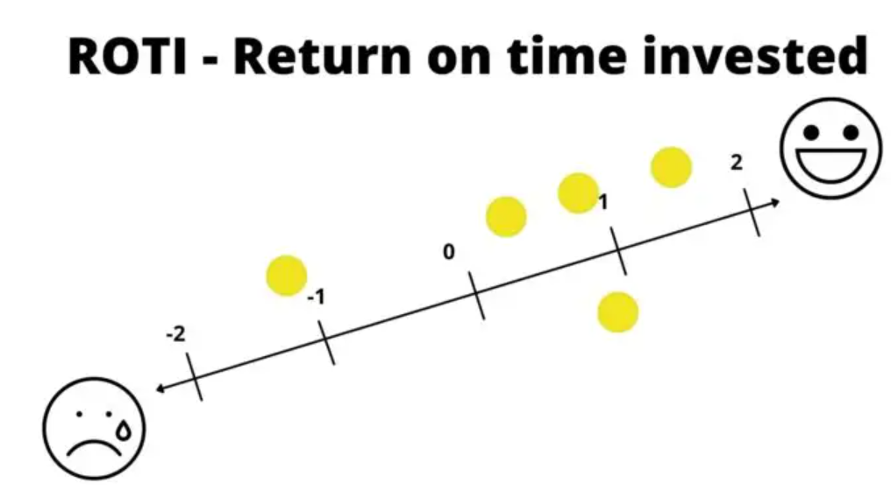

class: center, middle

## [Software Projektmanagement](index.html)

#### Kapitel 21

# Die Gestaltung von Meetings und Workshops

Pascal René Daniel

---
Die Gestaltung von Meetings und Workshops

----
# Inhalt

1. Die Rollen

2. Handwerkszeug des Moderators

3. Phasen der Moderation und ausgewählten Techniken

4. Regeln, Tipps und praktische Hinweise - Meetings/Workshops
   
---
Die Gestaltung von Meetings und Workshops

----
### Meeting und Workshop

**Meeting:**

- Arbeitnehmer aus einem bestimmten Arbeitsgebiet die Möglichkeit sich persönlich auszutauschen

- Sowohl bei Planungen, Problemen, einem Meinungsaustausch oder verschiedene Sachverhalte zu klären

**Workshop:** 

- Veranstaltung für kleinere Gruppen

- kooperative und moderierte Arbeitsweise an einem gemeinsamen Ziel

- begrenzte und kompakte Zeitdauer zu beachten

 

In jedem **Workshop** oder moderierten **Meeting** gibt es klare Rollen und damit auch Verantwortlichkeiten.

---
Die Gestaltung von Meetings und Workshops

----

### Die Rollen(Rollenverteilung)

 

|Rolle|Verantwortung|
|-|-|
|||
|**Auftraggeber**|für die Vorgabe des Ziels verantwortlich|
|**Moderator** |Plant & steuert den Workshop|
||Verantwortlich für den Ablauf der Veranstaltung|
||Unterstützt bei Bedarf und fördert das selbstständige Arbeiten jedes einzelnen aus der Gruppe|
|**Teilnehmer**|sind für die Qualität des Ergebnisses verantwortlich|
|**Projektleiter**|kann Moderator aber auch Teilnehmer sein oder beides|

---
Die Gestaltung von Meetings und Workshops

----

### Doppelrolle Teilnehmer - Moderator

---

Die Gestaltung von Meetings und Workshops

----

### Das Handwerkszeug des Moderators

Je umfassender der Wissensstand und die Handswerkzeuge des Moderators sind, umso gezielter und flexibler kann er in seiner Rolle arbeiten.

 

- **Fragetechnik PAKKO Modell**

- **Visualisieren**

- **Paraphrasieren**

- **Zusammenfassen**

---

Die Gestaltung von Meetings und Workshops

**Das Handwerkszeug des Moderators**

----

### PAKKO Modell

 

||| |
|-------------|---------------------------------------------|--------|
| **P**  | Persönlich                | Du, Sie, Ihr…  |
| **A** | Aktivierend                      | Nach persönlichen Erlebnissen fragen  |
| **K**  | Kurz und Knackig                                            | Einfache Sätze, keine Bandwurmkonstrukte, keine Verschachtelungen  |
| **K**  | Konkret                                            | Nach einem konkreten Aspekt des Themas fragen  |
| **O**  | Offen                                           | Offene W-Fragen stellen: wer, wann, was, warum, wie?

---
Die Gestaltung von Meetings und Workshops

**Das Handwerkszeug des Moderators**

----

### Visualisieren

- Unterstützt gemeinsames Arbeiten
  
- Probleme werden konkreter diskutiert
  
- Einfacheres Sortieren von Gedanken. Z.B. mit "Wichtig" und "Unwichtig"

-> **Aufgaben des Moderators**

> - Richtige Raumwahl und Arbeitsmaterial bereit stellen

> - Visualisierungsmöglichkeiten bereit stellen

> - Flipcharts nutzen

> - Aussagekräftige Farben und Symbole nutzen

---

Die Gestaltung von Meetings und Workshops

**Das Handwerkszeug des Moderators**

----

### Paraphrasieren

- Man wiederholt das Empfangene mit seinen eigenen Worten
  
- Sachlichen Inhalt wiedergeben

---

Die Gestaltung von Meetings und Workshops

**Das Handwerkszeug des Moderators**

----

### Zusammenfassen

- kurze Zusammenfassung nach Diskussion

- gemeinsames Verständis abgleichen

---
Die Gestaltung von Meetings und Workshops

----

## Phasen der Moderation und ausgewählten Techniken

---

Die Gestaltung von Meetings und Workshops

**Phasen der Moderation und ausgewählten Techniken**

----

**Einstiegsphase**

1. Jeder Teilnehmer erzählt kurz sein bisher schönstes Erlebnis am heutigen Tag
   
2. Flipchart vorbereiten mit Bewertungsschema
   
3. Was für Inhalte sollen in der nächsten Phase bearbeitet werden?

 

**Themen sammeln und clustern**

- Teilnehemer Ideen aufschreiben und aufhängen
  
- Zusammenfassen der Ideen bzw. Clustern
  
  - -> Überschriften dazu vergeben
  
  - -> Zusätzlich Mindmap(kein muss)

---

Die Gestaltung von Meetings und Workshops

**Phasen der Moderation und ausgewählten Techniken**

----

**Thema auswählen**

- Themenliste erstellen und gewichten
  
- Chronologisch auswählen oder das höher gewichtete wählen

 

**Thema bearbeiten**

- Thema ins Ishikawa-Diagramm übertragen

- Mind-Map 

- durch Flowchart(Flussdiagramm)

- Bearbeitung in Kleingruppen

---
Die Gestaltung von Meetings und Workshops

**Phasen der Moderation und ausgewählten Techniken**

----

**Maßnahmen planen**

 - Tabelle mit den geplanten Maßnahmen
    - Aktivität
  
    - Wer?

    - Bis wann?
  
    - Mit wem? 

**Abschluss**

- Feedback einzuholen
  
  - Was war im Workshop hilfreich?
  
  - Was war hinderlich? 
  
- Return on Time Invested

---
Die Gestaltung von Meetings und Workshops

**Phasen der Moderation und ausgewählten Techniken**

----

Quelle: https://meetingguru.de/stimmungsabfrage/

Bewertung mit Klebepunkten der Teilnehmer

- Negativer Raum wenig Nutzen für die investierte Zeit

- Positiver Raum hoher Nutzen für die investierte Zeit

Fragen stellen vom Moderator um die Bewertung besser zu verstehen.

---
Die Gestaltung von Meetings und Workshops

----

### Regeln, Tipps und praktische Hinweise

#### Vorbereitung des Moderators

- zeigen die wichtigsten Fragestellungen

---
Die Gestaltung von Meetings und Workshops

**Vorbereitung eines Meetings oder Workshops**

----

**Einladung**

- Uhrzeit richtig wählen für das Meeting
  
- Ziel der Veranstaltung angeben
  
- Agenda mit angeben

**Material**

- Haftnotizen und Stifte bereitstellen
  - Geeignete Farben und Größen der Stifte verwenden

- Pinnwand und ähnliches

- Kreppband, Klebepunkte, weiteres
  - um Sachen zu befestigen oder für Abstimmungen

---
Die Gestaltung von Meetings und Workshops

**Durchführung des Meetings oder Workshops**

----

### Praktische Hinweise

**Timeboxen**

- Zeitspanne vorher festlegen
- Sichtbare Uhr bereitstellen 
- Bei Ablaufen der Zeit, kurz vor ende Bescheid geben

**Hinweise zum Beschriften von Karten/Haftnotizen**

- Karteikarten nur mit gut lesbaren Filzstift beschriften
- Ein Punkt auf eine Karteikarte und kurz fassen
- Nur Druckschrift und Groß
  
**Weitere Hinweise**

- Jede Offene Frage/Diskussionspunkt notieren, so wie sie gestellt wurde
- Offene Fragen für alle Teilnehmer sichtbar darstellen -> Flipchart
- Flipchart in kombination mit Pinnwand für jegliche notizen
  
---
Die Gestaltung von Meetings und Workshops

**Durchführung des Meetings oder Workshops**

----

### Erste Kennenlernen

 

>**Alternative Reihenfolgen**

>-  nach Geburtstagen

>**Ball als Redezeichen** 

>- Ball irgendeinem zu werfen

>**Partnerinterview**

>- zwei Teilnehmer die sich nicht kennen

>**Steckbrief**

>- wird vorher verfasst und für alle sichtbar aufgehängt/angepinnt

---
Die Gestaltung von Meetings und Workshops

**Durchführung des Meetings oder Workshops**

----

### Arbeit mit Kleingruppen

**Sinn der Kleingruppen?**

- mehr Ideen
  
- intensiver Austausch
  
- animiert ruhigere Teilnehmer sich mit einzubringen

**Ideen für Gruppenbildung**

- Gruppenbildung über Puzzleteile
  
- Spiekkarten ziehen
  
- Gruppenbildung über Motive
  
- Paarbildung durch Ketten/Seile

---
Die Gestaltung von Meetings und Workshops

**Durchführung des Meetings oder Workshops**

----

### Arbeit mit Kleingruppen

**Die Arbeit in der Kleingruppe**

  *Genaue Punkte vorab bestimmen:*

  - Ziel der Gruppenarbeit
  
  - Aufgabenstellung für die Gruppenarbeit
  
  - Rollenklärung
  
    - wer macht was

**Austausch der Gruppenergebnisse im Plenum**

  - Ergebnis präsentieren
  
    - mit der ganzen Gruppe 
  
    - Ergebnisse nochmal kürzer fassen bzw. Clustern

---
Die Gestaltung von Meetings und Workshops

**Durchführung des Meetings oder Workshops**

----

### Meinungsbilder und Abstimmungen

- **Punkte kleben**
  
  - Einpunktfrage -> eine Stimme abgeben bzw. ein Klebepunkt
  
  - Mehrpunktfrage -> mehrere Stimmen abgeben
  
  - Mehrpunktfrage maximal 3 Punkte pro Option
  
- **Räumlich abstimmen**
  
  - jede Ecke hat eien andere Option
  
  - Stellen im Raum bestimmen die für Optionen stehen

- **Skale 1 - 10**
  
  - mit Kreppbank eine Skala, wo jeder sich dann irgendwo hinstellen kann

---
Die Gestaltung von Meetings und Workshops

**Abschluss der Moderation und Nachbereitung**

----

 
**Kurze Zusammenfassung des Ergebnisses und Ausblick**

- nächste Treffen vereinbart
  
- Themenwünsche für den nächsten Workshop schonmal besprechen

 

**Protokoll**

- Von den Ergebnissen Fotos machen und als PDF zusammenfassen
  
- fertiges Protokoll zeitnah an alle Teilnehmer versenden

 

**Folgeaufgaben**

- Aufgaben, die verteilt wurden? Diese einholen und auf Richtigkeit überprüfen

---
Die Gestaltung von Meetings und Workshops

**Spielregeln für Meetings**

----

- Es gibt unbewusste und bewusste Regeln
  -> in diesem Fall sind bewusst aufgestellte Regeln wichtiger

**Verhaltensregeln**

---

Die Gestaltung von Meetings und Workshops

**Spielregeln für Meetings**

----

**Meeting Knigge als Poster**

  

- Es zeigt klare Regeln für Teilnehmer und Moderator für die Vorbereitung, Durchführung und Nachbereitung von Besprechungen

- Es hängt im Meetingraum für alle sichtbar
---

Die Gestaltung von Meetings und Workshops

----

# Zusammenfassung

---

class: center, middle

# Fragen?
