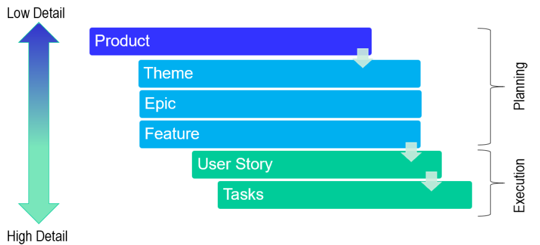

# Der rote Faden: Von der Projektvision zu Roadmap und Meilensteinen

---
Wie kann man ein Projekt planen?

- Grundidee
- Anforderungen 
- Abarbeiten

---

## Themen der Projektplanung

1. Vision
1. Projekt Charter
1. Stakeholder
2. Das Product Backlog
3. Theme, Epic, Feature, User Story
4. Minimum Viable Product
5. Story Map als Roadmap
6. Meilensteinplanung

---

# Vision
Die Vision ist das Zielbild des Projektes oder des Produktes

---

## Entwicklung der Vision

Ablauf:
1. Kleine Teams bilden
2. Visionen auf Flipchart-Papier schreiben
3. Visionen mittels **Elevator Pitch** oder **Product Box** Vorstellen
4. die Besten Ideen kombinieren

---
# Elevator Pitch
Elemente:
- Einprägsame Einleitung
- Ihre Identität
- Das Problem oder die Gelegenheit
- Ihre Lösung
- Alleinstellungsmerkmale
- Kunden oder Zielgruppe
- Beweise oder Erfolge
- Handlungsaufforderung
- Kurz und prägnant bleiben

---

# Product Box
Elemente: 
- Produktname und Branding
- Produktbild
- Wesentliche Merkmale
- Kundenwertversprechen
- Zielgruppe
- Preisgestaltung
- Verfügbarkeit
- Wettbewerbsvorteile
- Visuelles Design
- Zusätzliche Informationen

---

# Projekt Charter
Die Vision gibt die Richtung vor, die Project Charter genehmigt und klärt die Projektparameter genauer.

---

## Projekt Charter / Projektauftrag

- Project Charter (nach PMI und ISO 21500)
  - Iso 21500: internationale Norm für Projektmanagement
  - PMI: Project Management Institute
- Regeln für Projektgenehmigungen
- kleine Zusammenstellung der wichtigsten Rahmendaten
- Schriftlich zusammenstellen
- Die Projekt Charter gibt Antworten auf die W-Fragen:

---

## die W-Fragen

- Warum wird das Projekt gemacht?
- Was sind die messbaren Projektziele?
- Was sind Inhalt und Umfang?
- Wer ist beteiligt und betroffen (Stakeholder)?
- Wo und mit welchen Ressourcen wird das Projekt durchgeführt?
- Wann und in welchem Zeitrahmen soll das Projekt stattfnden?
- Wie soll das Projekt umgesetzt werden

---

## Darstellung der Project Charter

- Dokument
- Präsentation
- Grafische Darstellung
- Projektmanagement-Software
---

**Grafsche Darstellung als Project Canvas**

---
## Die Abstimmung und Genehmigung der Project Charter
- Überprüfung und Validierung
- Präsentation der Projekt-Charta
- Diskussion und Änderungen
- Genehmigung und Unterschriften
- Kommunikation
- (Die Team Charter)

---
# Stakeholder

**Defintion:** Stakeholder sind Personen, Gruppen oder Organisationen, die direkt oder indirekt von den Aktivitäten und Ergebnissen eines Projekts betroffen sind oder Interesse an ihnen haben

---

---

## Stakeholder-Analyse
- Identifikation der Stakeholder
- Analyse der Interessen und Bedürfnisse
- Bewertung des Einflusses
- Priorisierung
- Entwickeln von Strategien
- Umsetzung und Überwachung
- Stakeholder-Analyse Workshop
- Stakeholder-Register

---

Personas?
  
---

# Das Product Backlog

**Definition:** Das Product Backlog(Auftragsbestand) ist eine Liste von Aufgaben oder Anforderungen, die für die Produktentwicklung erforderlich sind. Es dient zur Organisation und Priorisierung der Arbeit, um die wichtigsten Aufgaben voranzutreiben.

---

## Eigenschaften eines Product Backlog
- Priorisierung
- Flexibilität
- Transparenz
- Kundenzentrierung
- Inkrementelle Entwicklung
- Effizienz und Fokussierung
  
---

## Darstellung eines Product Backlogs

---
## Owner des Product Backlogs

---
## Das initiale Befüllen und Priorisierung des Produkt Backlogs
- wichtigsten Anforderungen zuerst
- Priorisierung kann neu defimiert werden
- Felxibile

---
## Kriterien der Priorisieren

In der agilen Softwareentwicklung werden diese Begriffe verwendet, um eine klare Hierarchie von Aufgaben zu schaffen.

- **Themen (Themes)**: grobe Überschriften
- **Epics**: umfassende Aufgaben
- **Features**: eigenständige Funktionen
- **User Stories**: benutzerorientierte Beschreibungen von Funktionalitäten oder Aufgaben
- **Tasks**: konkrete Aufgaben

---

---

